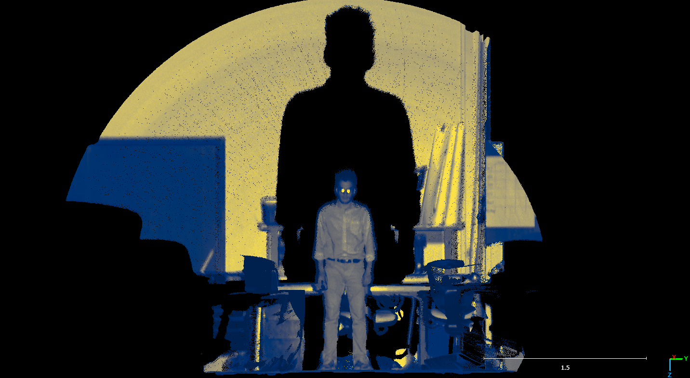

<hr>

# Livox\_Mid40\_Interactive\_Tool

An **interactive Jupyter-based control panel** for Livox MID-40 LiDAR sensors, built on top of [OpenPyLivox (OPL)](https://github.com/ryan-brazeal-ufl/OpenPyLivox). Now you can connect, start/stop recording, export to LAS—and even visualize your point cloud—all from a handful of buttons!

---

## ⭐ Highlights

* 🔌 **Connect** to your MID-40 over Ethernet
* ▶️ **Start Capture** — spin up, begin streaming, and write data to `interactive.bin` until you stop
* ⏹️ **Stop Capture** — halt the stream, spin down, and disconnect
* 📁 **Export LAS** — convert `interactive.bin` into `interactive.bin.las` with a single click
* 🔍 **Show LAS** — (optional extension) visualize the resulting `.las` in 3D right in your notebook

All status messages and logs appear inside a neat, scrollable output widget below the controls.

---

## 📦 Prerequisites

Make sure you have a working Python environment (e.g. Anaconda) with:

```bash
pip install -e .           # installs OpenPyLivox in editable mode
pip install ipywidgets     # interactive buttons
# If you want 3D LAS preview:
pip install laspy plotly   # point-cloud I/O and visualization
```

Ensure your PC’s Ethernet interface is on the same subnet as your MID-40 (e.g. `192.168.1.x`), and that Windows Firewall allows port **5602** traffic (or is temporarily disabled).

---

## 🚀 Getting Started

1. **Activate** your conda env and pull this project:

   ```bash
   conda activate openpylivox
   cd Livox_Mid40_Interactive_Tool
   ```
2. **Open** `interactive_capture_buttons8.ipynb` in VS Code or JupyterLab.
3. **Select** the **Python (openpylivox)** kernel (the one you registered).
4. **Run** the single notebook cell, then use the buttons to:

   * 🔌 **Connect**
   * ▶️ **Start Capture**
   * ⏹️ **Stop Capture**
   * 📁 **Export LAS**
   * 👁️ **Show LAS** (if you installed `laspy` & `plotly`)

---

## 📑 Attribution

This tool leverages and extends the incredible [OpenPyLivox](https://github.com/ryan-brazeal-ufl/OpenPyLivox) project by **Ryan Brazeal** (MIT-licensed). All core LiDAR communication and binary-to-LAS conversion logic come from OPL v1.1.0—my contributions are the interactive Jupyter UI, workflow automation, and inline visualization. Many thanks to the original author for making Livox programming accessible in Python!

---

## 🖼️ Sample Full-Density Point Cloud

Below is a photo showing a point cloud captured with the interactive tool when the MID‑40 sensor was left running for approximately **50 seconds**. This demonstrates the sustained, high-density sampling you can achieve:



---

## 📝 License

This interactive extension is released under the **MIT License**, same as OpenPyLivox. See [LICENSE](./LICENSE) for details.
